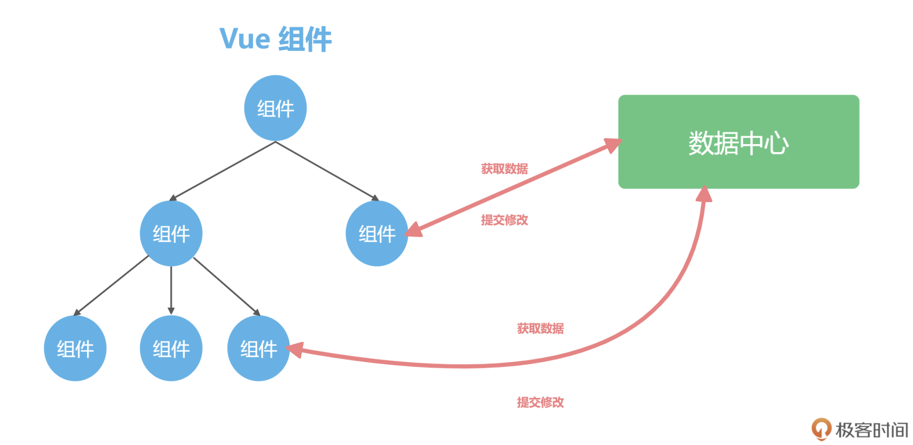

前面的基础入门篇中的几讲，都是针对 Vue 本身的进阶内容。通过这几讲，我们巩固和进阶了 Composition API、组件化和动画等关键知识，Vue 本身的知识点已经掌握得差不多了。那么从这一讲开始，我们进入课程的全家桶实战篇。

在全家桶实战篇，我们将一同学习 Vue 3 的生态，包括 Vuex、vue-router、Vue Devtools 等生态库，以及实战开发中需要用到的库。这⼀模块学完，你就能全副武装，应对复杂的项目开发也会慢慢得心应手。

今天，我先来带你认识一下 Vue 全家桶必备的工具：Vuex，有了这个神兵利器，复杂项目设计也会变得条理更清晰。接下来，让我们先从 Vuex 解决了什么问题说起。

# 前端数据管理

首先，我们需要掌握前端的数据怎么管理，现代 Web 应用都是由三大件构成，分别是：组件、数据和路由。关于组件化开发，在前面的第 8 讲中，已经有详细的讲解了。这一讲我们思考一个这样的场景，就是有一些数据组件之间需要共享的时候，应该如何实现？

解决这个问题的最常见的一种思路就是：专门定义一个全局变量，任何组件需要数据的时候都去这个全局变量中获取。一些通用的数据，比如用户登录信息，以及一个跨层级的组件通信都可以通过这个全局变量很好地实现。在下面的代码中我们使用 \_store 这个全局变量存储数据。

```javascript
window._store = {};
```

数据存储的结构图大致如下，任何组件内部都可以通过 window.\_store 获取数据并且修改。



但这样就会产生一个问题，window.\_store 并不是响应式的，如果在 Vue 项目中直接使用，那么就无法自动更新页面。所以我们需要用 ref 和 reactive 去把数据包裹成响应式数据，并且提供统一的操作方法，这其实就是数据管理框架 Vuex 的雏形了。

# Vuex 是什么

你现在肯定跟小圣有同样的困惑，那就是感觉 Vue 已经够用了，这个 Vuex 又是做什么的？其实，Vuex 存在的意义，就是管理我们项目的数据。

我们是使用组件化机制来搭建整个项目，每个组件内部有自己的数据和模板。但是总有些数据是需要共享的，比如当前登录的用户名、权限等数据，如果都在组件内部传递，会变得非常混乱。

如果把开发的项目比作公司的话，我们项目中的各种数据就非常像办公用品。很多小公司在初创时期不需要管理太多，大家随便拿办公用品就行。但是公司大了之后，就需要一个专门的办公用品申报的流程，对数据做统一地申请和发放，这样才能方便做资产管理。**Vuex 就相当于我们项目中的大管家，集中式存储管理应用的所有组件的状态。**

下面，我们先来上手使用一下 Vuex。我们项目结构中的 src/store 目录，就是专门留给 Vuex 的，在项目的目录下，我们执行下面这个命令，进行 Vuex 的安装工作。

```javascript
npm install vuex@next
```

安装完成后，我们在 src/store 中先新建 index.js，在下面的代码中，我们使用 createStore 来创建一个数据存储，我们称之为 store。

store 内部除了数据，还需要一个 mutation 配置去修改数据，你可以把这个 mutation 理解为数据更新的申请单，mutation 内部的函数会把 state 作为参数，我们直接操作 state.count 就可以完成数据的修改。

```javascript
import { createStore } from "vuex";

const store = createStore({
  state() {
    return {
      count: 666,
    };
  },
  mutations: {
    add(state) {
      state.count++;
    },
  },
});
```

现在你会发现，我们的代码里，在 Vue 的组件系统之外，多了一个数据源，里面只有一个变量 count，并且有一个方法可以累加这个 count。然后，我们在 Vue 中注册这个数据源，在项目入口文件 src/main.js 中，使用 app.use(store) 进行注册，这样 Vue 和 Vuex 就连接上了。

然后，我们使用 .use 就可以对路由进行注册，使用 .mount 就可以把 Vue 这个应用挂载到页面上，代码如下。

```javascript
const app = createApp(App);
app.use(store).use(router).mount("#app");
```

之后，我们在 src/components 文件夹下新建一个 Count.vue 组件，在下面的代码中，template 中的代码我们很熟悉了，就是一个 div 渲染了 count 变量，并且点击的时候触发 add 方法。在 script 中，我们使用 useStore 去获取数据源，初始化值和修改的函数有两个变化：

- count 不是使用 ref 直接定义，而是使用计算属性返回了 store.state.count，也就是刚才在 src/store/index.js 中定义的 count。
- add 函数是用来修改数据，这里我们不能直接去操作 store.state.count +=1，因为这个数据属于 Vuex 统一管理，所以我们要使用 store.commit(‘add’) 去触发 Vuex 中的 mutation 去修改数据。

```html
<template>
  <div @click="add">{{count}}</div>
</template>

<script setup>
  import { computed } from "vue";
  import { useStore } from "vuex";
  let store = useStore();
  let count = computed(() => store.state.count);

  function add() {
    store.commit("add");
  }
</script>
```
